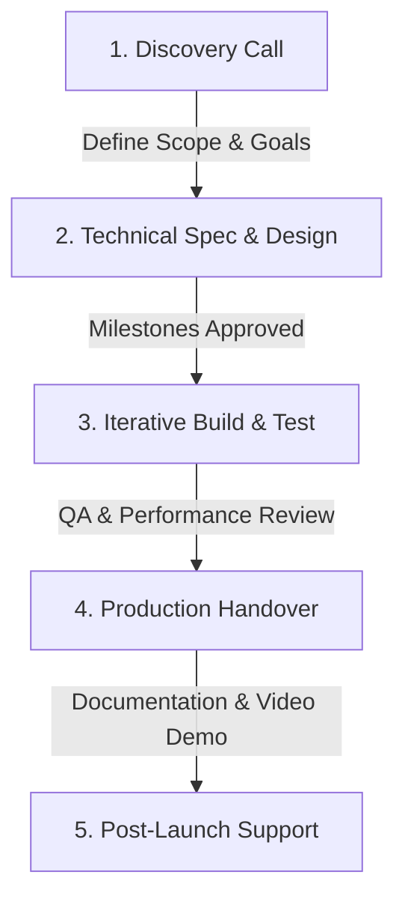

<!-- Replace YOUR_GITHUB_USERNAME with your actual GitHub username -->

  

  

  

  

  

  <b>⚡ Status:</b> Active &amp; Booking Projects | <b>🌍 Location:</b> Surat, India (UTC+5:30) | <b>🚀 Delivery:</b> Production-ready, clean, documented code

## 🛠️ Services I Offer to Clients

If you are looking to automate manual workflows, make predictions from your business data, or build smart applications, here is how I can help:

<table width="100%">
  <tr>
    <td width="33.3%" valign="top">
      <h4>🤖 AI &amp; Automation</h4>
      
Build custom AI assistants, automated search tools, web crawlers, and LLM-powered applications that save hours of manual research.

      <ul>
        <li>RAG / Document search</li>
        <li>Custom LLM integration</li>
        <li>Discord/Slack automation bots</li>
      </ul>
    </td>
    <td width="33.3%" valign="top">
      <h4>📈 Machine Learning</h4>
      
Train predictive models, classify complex data, and build time-series forecasting pipelines tailored to your operations.

      <ul>
        <li>Time-series forecasting</li>
        <li>LightGBM &amp; PyTorch models</li>
        <li>Classification &amp; Churn models</li>
      </ul>
    </td>
    <td width="33.3%" valign="top">
      <h4>📊 Data &amp; Dashboards</h4>
      
Clean messy datasets, set up automated ETL pipelines, and create interactive dashboards that make business data easy to read.

      <ul>
        <li>Power BI dashboards</li>
        <li>Streamlit web applications</li>
        <li>Pandas/SQL pipelines</li>
      </ul>
    </td>
  </tr>
</table>

## 💼 Solutions Delivered (Case Studies)

Here are examples of projects I have engineered from concept to working code:

<table width="100%">
  <tr>
    <!-- Left Column: Complex Systems -->
    <td width="50%" valign="top">
      <h3>📈 Algorithmic ML/RL Engine</h3>
      
<b>The Challenge:</b> Manual trading rules were too slow and struggled to adjust to shifting market regimes.

      
<b>The Solution:</b> Built a hybrid ML/RL decision pipeline processing 1.2M+ high-frequency records. Combines PyTorch TCN sequence modeling, Gaussian HMM for regime detection, and a custom DRQN (LSTM) reinforcement learning agent.

      
<i><b>Stack:</b> Python, PyTorch, LightGBM, RL, NumPy, Pandas</i>

    </td>
    <!-- Right Column: Business Dashboards & Tools -->
    <td width="50%" valign="top">
      <h3>📊 Sales &amp; Demand Forecasting</h3>
      
<b>The Challenge:</b> Sales reporting was purely historical, giving management no tools to anticipate future demand.

      
<b>The Solution:</b> Designed an end-to-end data pipeline that models historical sales trends, generating forward forecasts visualised inside an interactive Power BI dashboard.

      
<i><b>Stack:</b> Python, Scikit-learn, Pandas, Power BI</i>

    </td>
  </tr>
  <tr>
    <!-- Left Column: Recommender System -->
    <td width="50%" valign="top">
      <h3>🎬 Content Recommendation System</h3>
      
<b>The Challenge:</b> Building an easy-to-use recommendation system with secure authentication.

      
<b>The Solution:</b> Developed a full-stack, content-based recommendation platform with user auth, handling databases locally and rendering via a sleek web UI. <a href="https://github.com/Rushit16102004/Movie-recommender"><b>View Code ↗</b></a>

      
<i><b>Stack:</b> Streamlit, SQLite, Python, Scikit-learn</i>

    </td>
    <!-- Right Column: NLP -->
    <td width="50%" valign="top">
      <h3>🧠 Sentiment Analysis Pipeline</h3>
      
<b>The Challenge:</b> Manually analyzing customer review text to extract business insights was slow and subjective.

      
<b>The Solution:</b> Built an automated text preprocessing and classification tool using TF-IDF feature extraction to group reviews and output sentiment data.

      
<i><b>Stack:</b> Python, NLP, TF-IDF, Scikit-learn</i>

    </td>
  </tr>
</table>

## ⚙️ How We Work Together

To ensure you get exactly the system you need without delays:

1. **Discovery:** We hop on a quick call or chat to map out your workflow, data, and what business problem we are solving.
2. **Architecture:** I draft a simple technical spec showing how the data flows, what models we'll use, and how it will be delivered.
3. **Build & Refine:** I write the code, train the models, and test them with real edge cases, keeping you updated with live progress.
4. **Handover:** You get clean, fully documented code, setup scripts, and a screen recording walking you through how to run and manage it.

## 📬 Let's Discuss Your Project!

Got a manual workflow you want to automate? Or a dataset you want to turn into predictions? Get in touch!

*   📧 **Email:** [bodrarushit@gmail.com](mailto:bodrarushit@gmail.com)
*   💬 **WhatsApp/Phone:** [+91-8160034453](tel:+918160034453)
*   💼 **LinkedIn:** [rushit-bodra-ml](https://linkedin.com/in/rushit-bodra-ml)
